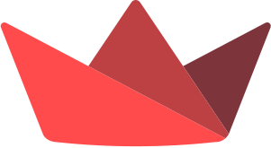

<!-- PROJECT LOGO -->
 

  

<h1 align="center">AiRapFR </h1>

  

    Générateur de textes, produisant des phrases et des couplets de rap en français, en s'inspirant du style, de la structure et des thèmes abordés par les rappeurs français.
     
    <a href="https://github.com/othneildrew/Best-README-Template"><strong>Demo Streamlit</strong></a>

  

  

## Usage

Use this space to show useful examples of how a project can be used.
Additional screenshots, code examples and demos
work well in this space. You may also link to more resources.

_For more examples, please refer to the [Documentation](https://example.com)_

## Acknowledgments

* [Genius API](https://docs.genius.com)
* [Streamlit](https://streamlit.io/)

## Contact

- 📬 mlamali.saidsalimo [ at ] gmail.com 📬
- Find me on [LinkedIn](https://www.linkedin.com/in/mlamalisaidsalimo/) or read me
  on [Medium](https://medium.com/wanabilini) ☺️.

